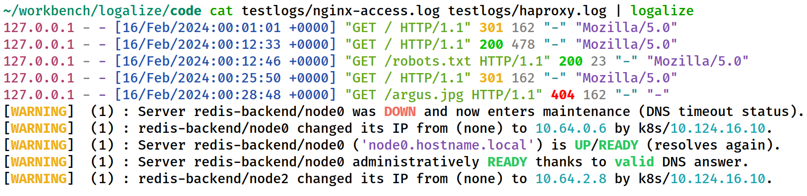

Original PNG [207 KB]
------------

<picture>
  <source media="(prefers-color-scheme: dark)" srcset="images/png/screenshot-dark.png">
  <source media="(prefers-color-scheme: light)" srcset="images/png/screenshot-light.png">
  
</picture>

convert image.png image.avif [76 KB]
------------

<picture>
  <source media="(prefers-color-scheme: dark)" srcset="images/avif/screenshot-dark.avif">
  <source media="(prefers-color-scheme: light)" srcset="images/avif/screenshot-light.avif">
  
</picture>

avifenc image.png image.avif [153 KB]
------------

<picture>
  <source media="(prefers-color-scheme: dark)" srcset="images/avif2/screenshot-dark.avif">
  <source media="(prefers-color-scheme: light)" srcset="images/avif2/screenshot-light.avif">
  
</picture>

cavif image.png -o image.avif [106 KB]
------------

<picture>
  <source media="(prefers-color-scheme: dark)" srcset="images/avif3/screenshot-dark.avif">
  <source media="(prefers-color-scheme: light)" srcset="images/avif3/screenshot-light.avif">
  
</picture>

cavif --color=rgb image.png -o image.avif [151 KB]
------------

<picture>
  <source media="(prefers-color-scheme: dark)" srcset="images/avif4/screenshot-dark.avif">
  <source media="(prefers-color-scheme: light)" srcset="images/avif4/screenshot-light.avif">
  
</picture>

cavif --color=rgb --speed=1 image.png -o image.avif [137 KB]
------------

<picture>
  <source media="(prefers-color-scheme: dark)" srcset="images/avif5/screenshot-dark.avif">
  <source media="(prefers-color-scheme: light)" srcset="images/avif5/screenshot-light.avif">
  
</picture>

cavif --color=rgb --speed=1 --quality=50 image.png -o image.avif [102 KB]
------------

<picture>
  <source media="(prefers-color-scheme: dark)" srcset="images/avif6/screenshot-dark.avif">
  <source media="(prefers-color-scheme: light)" srcset="images/avif6/screenshot-light.avif">
  
</picture>

cavif --color=rgb --speed=1 --quality=30 image.png -o image.avif [72 KB]
------------

<picture>
  <source media="(prefers-color-scheme: dark)" srcset="images/avif7/screenshot-dark.avif">
  <source media="(prefers-color-scheme: light)" srcset="images/avif7/screenshot-light.avif">
  
</picture>
